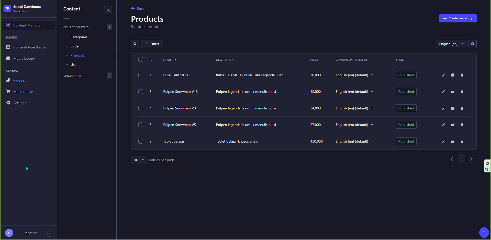
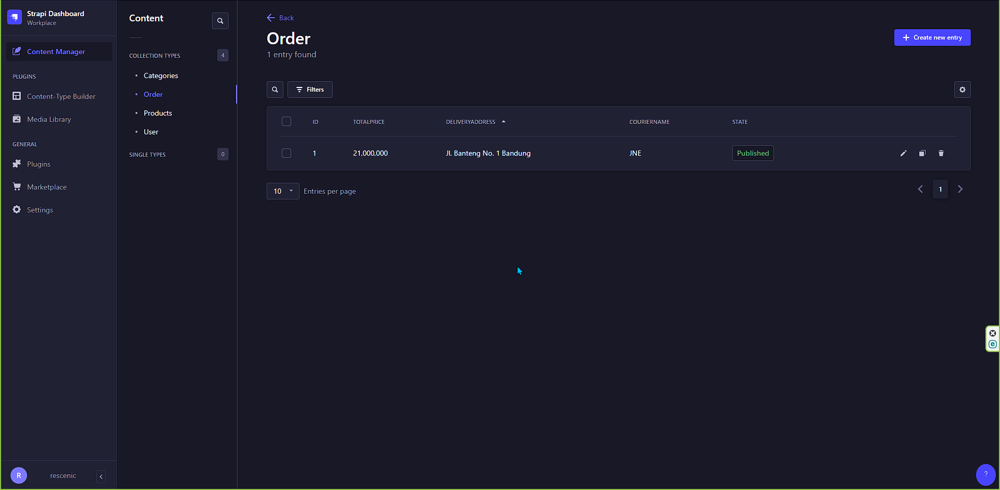
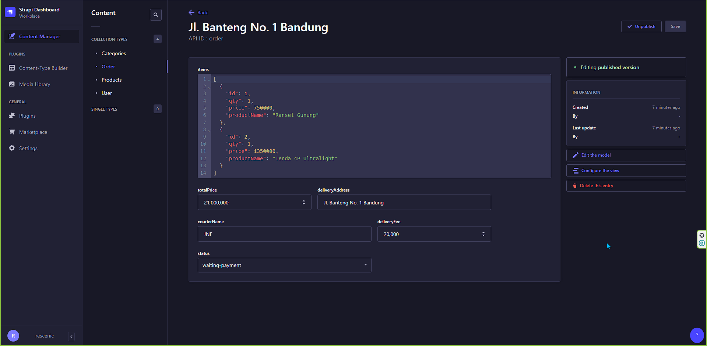
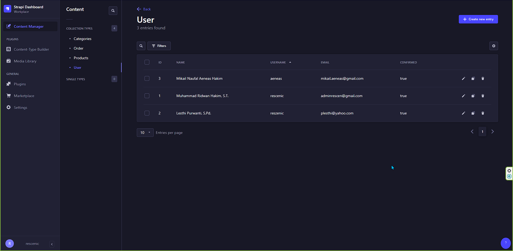
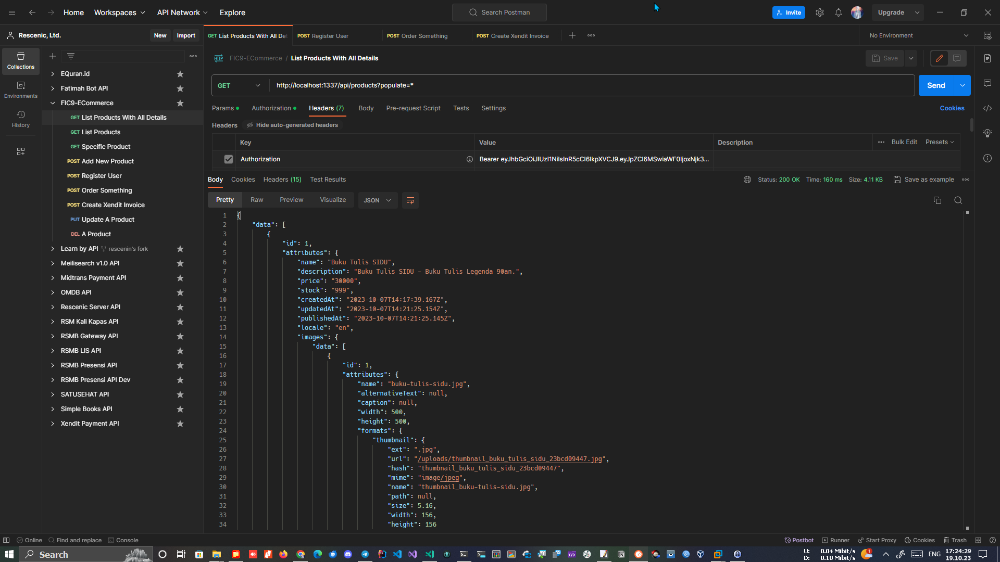
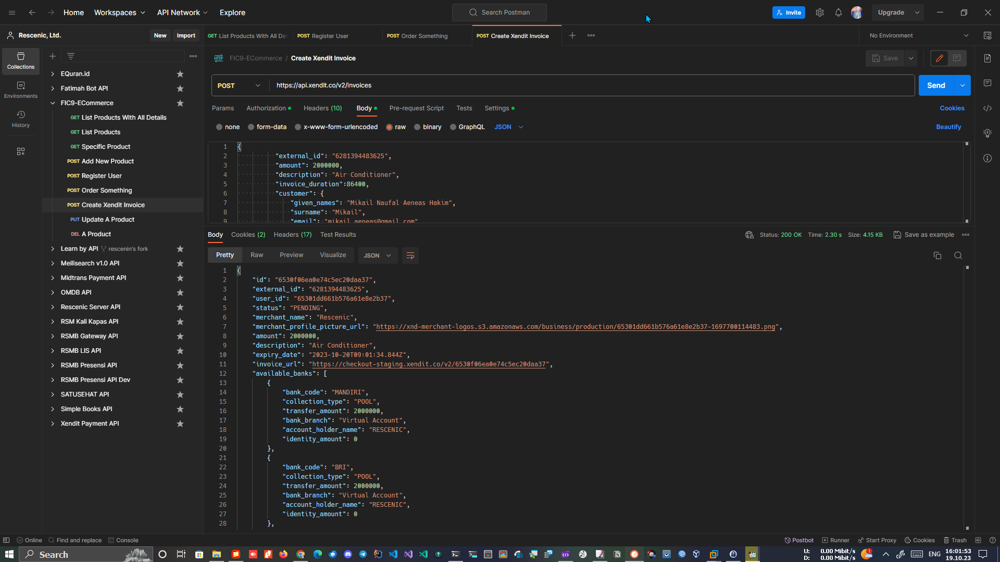
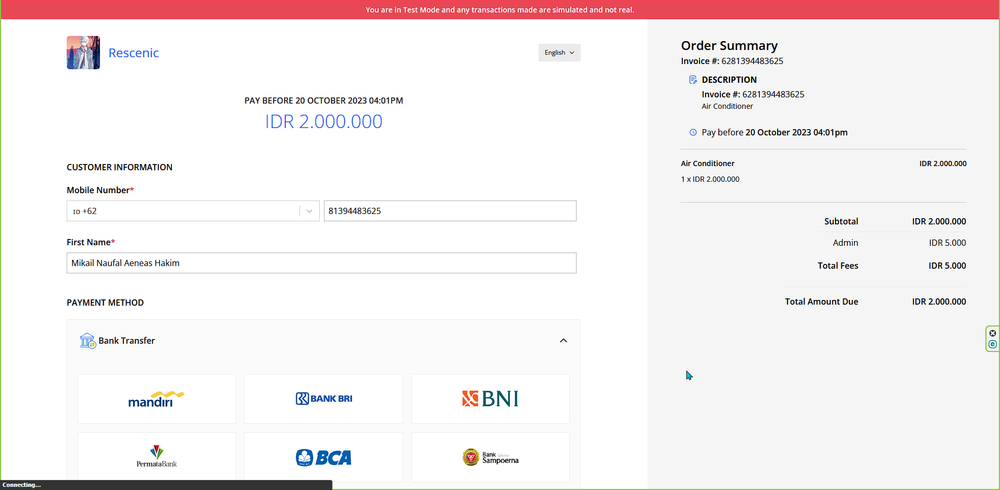
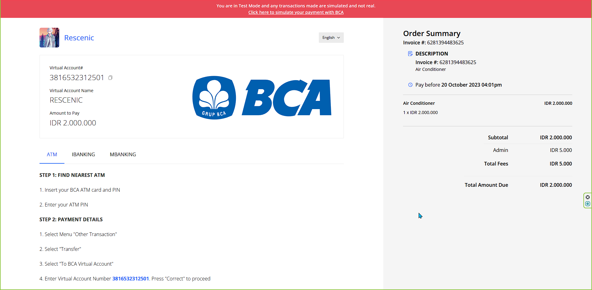
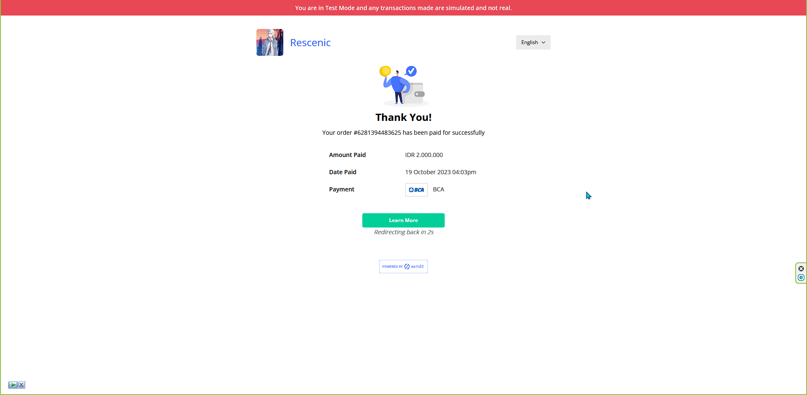
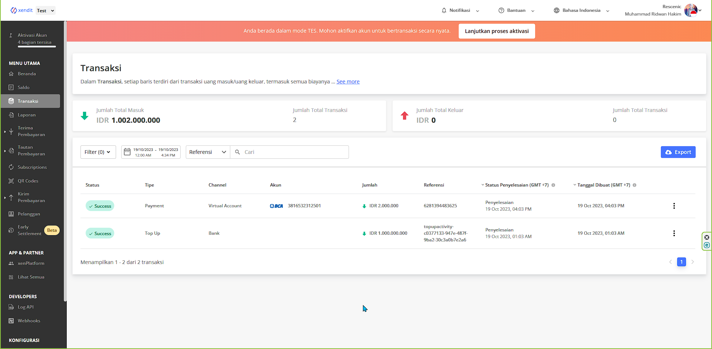

# 🚀 Getting started with Strapi

Strapi comes with a full featured [Command Line Interface](https://docs.strapi.io/dev-docs/cli) (CLI) which lets you scaffold and manage your project in seconds.

### `develop`

Start your Strapi application with autoReload enabled. [Learn more](https://docs.strapi.io/dev-docs/cli#strapi-develop)

```
npm run develop
# or
yarn develop
```

### `start`

Start your Strapi application with autoReload disabled. [Learn more](https://docs.strapi.io/dev-docs/cli#strapi-start)

```
npm run start
# or
yarn start
```

### `build`

Build your admin panel. [Learn more](https://docs.strapi.io/dev-docs/cli#strapi-build)

```
npm run build
# or
yarn build
```

## ⚙️ Deployment on localhost
<br>
<br>
<br>
<br>
<br>
<br>
<br>
<br>
<br>
<br>
<br>



